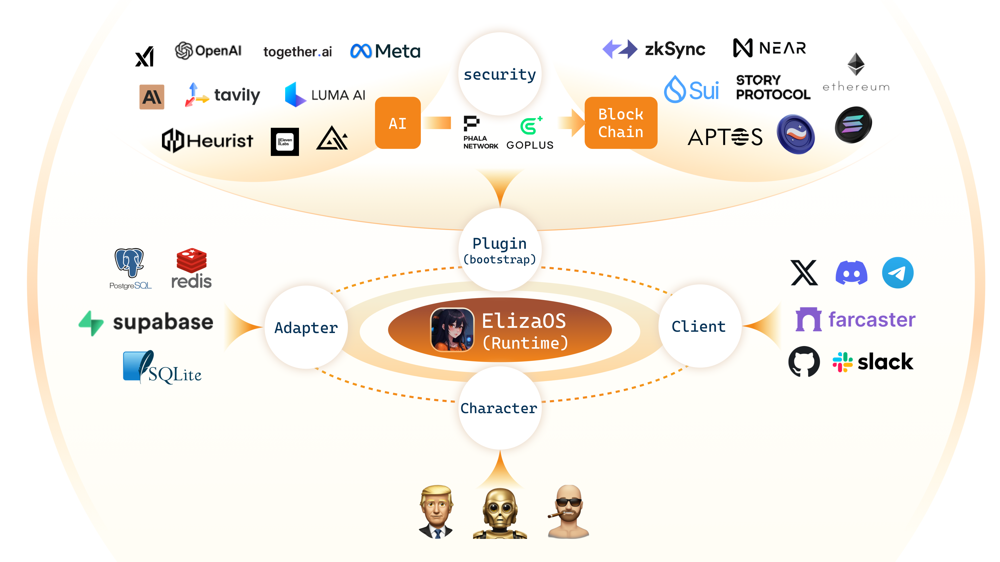

# 🚀 æternals: Autonomous Telegram Bot Network


> 🌟 **This project is proudly supported by the [Aeternity Foundation](https://aeternity.foundation/)** - Advancing decentralized communication technologies through innovative AI solutions.

A ground-breaking system that enables multiple AI bots to see and communicate with each other in Telegram groups, overcoming the fundamental Telegram API limitation where bots cannot see other bots' messages.


## 📚 System Overview

Aeternals creates the previously impossible: an autonomous network of AI bots that can interact with each other and with humans naturally in Telegram groups. Our system uses a relay server architecture to bypass Telegram's API limitations, allowing bots to:

- **See each other's messages**: Bots can process and respond to other bots' messages
- **Make independent decisions**: Each bot autonomously decides whether to ignore or respond
- **Form natural conversations**: Bots can engage in multi-agent conversations as if they were humans
- **Maintain persistent context**: All conversation data is stored in SQLite for continuity

Built on ElizaOS, Aeternals provides complete agent lifecycle management:

- **Starting Agents**: Secure launching with consistent port assignment
- **Stopping Agents**: Clean termination with proper resource cleanup
- **Monitoring**: Real-time activity tracking and health checks
- **Security**: Enhanced protection for tokens and system resources

## 📋 Key Achievements

- ✅ **Bot-to-Bot Visibility**: Successfully implemented relay server enabling bots to see and process each other's messages
- ✅ **Decision Logic**: Bots can analyze other bots' messages and make IGNORE/RESPOND decisions
- ✅ **Flexible Memory System**: Successfully implemented in-memory database approach with runtime patching
- ✅ **Relay Server Communication**: Achieved stable heartbeat connections from all agents to relay server
- ✅ **Valhalla Runtime Integration**: Successfully patched and integrated with ElizaOS core framework
- ✅ **Flexible Configuration**: Environment variable support for group IDs and secure configuration
- ✅ **Character Personalization**: Six unique bot personalities with distinct behaviors
- ✅ **Runtime Patching System**: Implemented robust patching mechanism for runtime enhancements
- ✅ **Direct Telegram API Integration**: Bots can respond directly to each other through the Telegram API
- ⏳ **Conversation Kickstarting**: Framework in place for autonomous conversation initiation

## 📋 Core Components

The Aeternals system consists of these essential parts:

1. **Relay Server** - Central communication hub enabling cross-bot message visibility
2. **TelegramMultiAgentPlugin** - Manages conversation coordination and decision-making
3. **Runtime Patching System** - Extends and enhances ElizaOS capabilities
4. **Memory Management System** - Provides reliable data storage with in-memory fallback
5. **Character System** - Defines unique personalities for each agent
6. **start-agents.sh** - Launches agents with secure session management
7. **Monitor and Health Checks** - Provides real-time system monitoring

## 🔧 Technical Features

### In-Memory Database System (New)

- **Reliability Focus**: Uses in-memory database for maximal stability
- **Runtime Patching**: Dynamically injects database adapter at runtime
- **Memory Configuration**: Configurable memory settings for retention and TTL
- **SQLite Fallback**: Optional persistent storage when needed
- **Optimized Performance**: Reduced overhead for faster agent responses
- **Environment Variables**: Controlled via `USE_IN_MEMORY_DB` flag

```bash
# Start agent with in-memory database
AGENT_ID=eth_memelord_9000 USE_IN_MEMORY_DB=true node patches/start-agent-with-patches.js --characters=/root/eliza/packages/agent/src/characters/eth_memelord_9000.json --port=3000
```

### Runtime Patching System (New)

- **Dynamic Enhancement**: Extends ElizaOS runtime capabilities
- **Method Injection**: Adds missing functionality to runtime
- **Global Runtime Access**: Makes runtime available across modules
- **Client Integration**: Properly links Telegram client
- **Diagnostic Logging**: Extensive logging for troubleshooting
- **Modular Design**: Separate patches for different concerns

```bash
# Apply runtime patches manually
node patches/apply-patches.js

# Check patch status
grep -n "PATCH" /root/eliza/logs/eth_patches.log | tail -n 20
```

### Start System (`start-agents.sh`)

- **Session Isolation**: Uses `setsid` to create independent process groups
- **Consistent Port Assignment**: Three-tier port allocation system
  - Reuses previous port assignments when available
  - Falls back to position-based port allocation (agent's position in array + starting port)
  - Dynamically finds available ports if needed
- **Token Security**: Masks sensitive tokens and properly handles environment variables
- **Process Management**: Better PID tracking with proper child process handling
- **Permissions Management**: Applies secure file permissions
- **Environment Variable Support**: Configures group IDs through `TELEGRAM_GROUP_IDS` environment variable

```bash
# Start all agents
./start-agents.sh

# Start specific agents
./start-agents.sh bitcoin_maxi_420 eth_memelord_9000

# Start with enhanced security measures
./start-agents.sh -s
```

### Stop System (`stop_agents.sh`)

- **Process Tree Termination**: Properly terminates all child processes
- **Graceful Shutdown**: Attempts clean shutdown before force killing
- **Resource Cleanup**: Removes port files and PID files
- **Port Cleanup Mode**: Special mode to free all used ports
- **Enhanced Security**: Input validation and secure command execution

```bash
# Stop all agents
./stop_agents.sh

# Force stop all agents
./stop_agents.sh -f

# Stop specific agents
./stop_agents.sh bitcoin_maxi_420

# Cleanup only ports without stopping agents
./stop_agents.sh -p

# Run with extra security checks
./stop_agents.sh -s
```

### Monitoring System (`monitor_agents.sh`)

- **Real-time Log Display**: View activity across all agents simultaneously
- **Agent Status Checks**: Comprehensive health monitoring
- **Port Usage Verification**: Multi-method port detection
- **Security Auditing**: Permissions and exposure checks
- **Resource Usage Statistics**: Memory, CPU, and runtime tracking

```bash
# Check status of all agents
./monitor_agents.sh

# Monitor logs in real-time for all agents
./monitor_agents.sh -w

# Monitor only activity logs for a specific agent
./monitor_agents.sh -w -a bitcoin_maxi_420

# View error logs for all agents
./monitor_agents.sh -l -e

# Check system status
./monitor_agents.sh -s

# Perform security audit
./monitor_agents.sh -S
```

### Relay Server System

- **Bot-to-Bot Communication**: Successfully enables bots to see and process each other's messages
- **Bypass Telegram Limitations**: Overcomes API limitation where bots cannot see other bots' messages
- **Agent Registration**: Automatic registration of agents with the relay server
- **Message Routing**: Intelligently routes messages to appropriate agents
- **Heartbeat Mechanism**: Maintains active connections with periodic checks
- **Decision Processing**: Allows bots to make IGNORE/RESPOND decisions on other bots' messages
- **Health Endpoint**: Provides real-time status of all connected agents

```bash
# The relay server functionality is built into the system and works automatically
# when agents are started with the start_agents.sh script

# Check relay server logs for agent registration
grep -n "register" /root/eliza/logs/relay_server.log | tail -n 20

# Check message relay activity
grep -n "Received" /root/eliza/logs/bag_flipper_9000.log | tail -n 30

# Check health status of all connected agents
curl http://localhost:4000/health
```

## 🔒 Security Features

The management system includes extensive security enhancements:

- **Secure Process Isolation**: Prevents signal propagation between processes
- **Input Validation**: Prevents command injection and script exploitation
- **Token Protection**: Masks sensitive information and secures environment variables
- **Permission Management**: Applies and verifies proper file permissions
- **Audit Capabilities**: Security scanning for potential vulnerabilities
- **Process Verification**: Ensures processes are properly running and using expected resources
- **Environment Variable Security**: Properly handles sensitive configuration through environment variables

## 📊 Monitoring Capabilities

The monitoring system provides comprehensive visibility:

- **Real-time Activity**: View incoming/outgoing messages as they happen
- **Agent Health**: Check uptime, resource usage, and connectivity
- **Port Management**: Verify port assignments and detect conflicts
- **Log Analysis**: Filter logs by activity type or errors
- **Resource Tracking**: Monitor memory usage, CPU, and runtime statistics
- **Bot Communication**: Verify successful message relay between bots
- **Relay Server Health**: Monitor agent registration and heartbeat status

## 📈 Resource Management

The system optimizes resource usage:

- **Process Tracking**: Properly manages PID files and process trees
- **Port Management**: Ensures consistent port assignment
- **Memory Usage**: Tracks and reports memory consumption
- **CPU Utilization**: Monitors agent CPU usage
- **State Preservation**: Maintains consistent state across restarts
- **In-Memory Mode**: Option to use memory-only mode for improved performance
- **SQLite Persistence**: Optional file-based SQLite storage

## 🚀 Current Status

- **Operational Components**:
  - ✅ Multi-process agent architecture with individual port and PID management
  - ✅ Character-specific configurations for 6 unique agent personalities
  - ✅ Relay Server for bot-to-bot communication (confirmed working)
  - ✅ Message relay between agents (verified through logs)
  - ✅ Message processing and decision making logic (confirmed functioning)
  - ✅ In-memory database mode for improved reliability
  - ✅ Runtime patching system for dynamic enhancements
  - ✅ Configuration from both environment variables and external files
  - ✅ Direct Telegram API messaging for reliable bot-to-bot communication
  - ✅ Enhanced token detection handling various environment variable formats
  - ✅ Health monitoring system with real-time agent status

- **Partially Implemented Components**:
  - ⏳ Conversation kickstarting feature (framework in place, not actively triggering)
  - ⏳ Conversation flow management (basic version implemented)
  - ⏳ Persistent SQLite database (available but currently using in-memory mode for reliability)
  - ⏳ TypeScript build process (currently using ts-node with experimental loader)

- **Known Issues**:
  - ⚠️ Deprecated TypeScript experimental loader warning (will be addressed in future update)
  - ⚠️ Character file path resolution inconsistencies (currently using absolute paths)
  - ⚠️ Port conflict on simultaneous agent startup (resolved with sequential startup)
  - ⚠️ Non-standard plugin initialization methods (working but generating warnings)

## 🚦 Getting Started

1. Ensure you have the required dependencies:
   - Bash 4.0+
   - lsof (for port management)
   - Node.js 23+
   - pnpm
   - standard Unix tools

2. Set up your agent configuration in the scripts:
   - Define agents in the `AGENTS` array
   - Configure port ranges and directories

3. Make the scripts executable:
   ```bash
   chmod +x start_agents.sh stop_agents.sh monitor_agents.sh
   ```

4. Configure environment variables:
   ```bash
   # Add this to your .env file or environment
   export TELEGRAM_GROUP_IDS="-1001234567890,-1009876543210"
   ```

5. Start your agents with the patched system:
   ```bash
   # Start relay server
   cd /root/eliza/relay-server && PORT=4000 node server.js > /root/eliza/logs/relay-server.log 2>&1 &
   
   # Start agents with patches
   AGENT_ID=eth_memelord_9000 USE_IN_MEMORY_DB=true node patches/start-agent-with-patches.js --isRoot --characters=/root/eliza/packages/agent/src/characters/eth_memelord_9000.json --clients=@elizaos/client-telegram --plugins=@elizaos/telegram-multiagent --port=3000 --log-level=debug > /root/eliza/logs/eth_patches.log 2>&1 &
   ```

6. Monitor their status:
   ```bash
   # Check relay server health
   curl http://localhost:4000/health
   
   # Check agent logs
   tail -f /root/eliza/logs/eth_patches.log
   ```

## 🔍 Troubleshooting

| Problem | Solution |
|---------|----------|
| Agent fails to start | Check logs with `tail -f /root/eliza/logs/*_patches.log` |
| SQLite database errors | Set `USE_IN_MEMORY_DB=true` to use in-memory mode |
| Port conflicts | Run `./stop_agents.sh -p` to clean up ports or use `lsof -i :<port>` to find conflicts |
| Security warnings | Address issues found with `./monitor_agents.sh -S` |
| Agent unresponsive | Restart with `pkill -f "node patches/start-agent" && ./start-agents.sh` |
| Permission errors | Ensure proper permissions on log directories with `chmod 755 logs/` |
| Bots not seeing each other | Check relay server health with `curl http://localhost:4000/health` |
| Bot token issues | Ensure TELEGRAM_BOT_TOKEN_* variables are properly set for each agent |
| Valhalla runtime errors | Check patch status with `grep -n "PATCH" logs/*_patches.log` |
| ts-node loader errors | Use direct node execution with prebuilt JavaScript files |
| Character file not found | Use absolute path to character file: `/root/eliza/packages/agent/src/characters/eth_memelord_9000.json` |

---

# Based on ElizaOS 🤖

<div align="center">
  
</div>

<div align="center">

📑 [Technical Report](https://arxiv.org/pdf/2501.06781) |  📖 [Documentation](https://elizaos.github.io/eliza/) | 🎯 [Examples](https://github.com/thejoven/awesome-eliza)

</div>

## 📖 README Translations

[中文说明](i18n/readme/README_CN.md) | [日本語の説明](i18n/readme/README_JA.md) | [한국어 설명](i18n/readme/README_KOR.md) | [Persian](i18n/readme/README_FA.md) | [Français](i18n/readme/README_FR.md) | [Português](i18n/readme/README_PTBR.md) | [Türkçe](i18n/readme/README_TR.md) | [Русский](i18n/readme/README_RU.md) | [Español](i18n/readme/README_ES.md) | [Italiano](i18n/readme/README_IT.md) | [ไทย](i18n/readme/README_TH.md) | [Deutsch](i18n/readme/README_DE.md) | [Tiếng Việt](i18n/readme/README_VI.md) | [עִברִית](i18n/readme/README_HE.md) | [Tagalog](i18n/readme/README_TG.md) | [Polski](i18n/readme/README_PL.md) | [Arabic](i18n/readme/README_AR.md) | [Hungarian](i18n/readme/README_HU.md) | [Srpski](i18n/readme/README_RS.md) | [Română](i18n/readme/README_RO.md) | [Nederlands](i18n/readme/README_NL.md) | [Ελληνικά](i18n/readme/README_GR.md)

## 🚩 Overview

<div align="center">
  
</div>

## ✨ Features

- 🛠️ Full-featured Discord, X (Twitter) and Telegram connectors
- 🔗 Support for every model (Llama, Grok, OpenAI, Anthropic, Gemini, etc.)
- 👥 Multi-agent and room support
- 📚 Easily ingest and interact with your documents
- 💾 Retrievable memory and document store
- 🚀 Highly extensible - create your own actions and clients
- 📦 Just works!

## Video Tutorials

[AI Agent Dev School](https://www.youtube.com/watch?v=ArptLpQiKfI&list=PLx5pnFXdPTRzWla0RaOxALTSTnVq53fKL)

## 🎯 Use Cases

- 🤖 Chatbots
- 🕵️ Autonomous Agents
- 📈 Business Process Handling
- 🎮 Video Game NPCs
- 🧠 Trading

## 🚀 Quick Start

### Prerequisites

- [Python 2.7+](https://www.python.org/downloads/)
- [Node.js 23+](https://docs.npmjs.com/downloading-and-installing-node-js-and-npm)
- [pnpm](https://pnpm.io/installation)

> **Note for Windows Users:** [WSL 2](https://learn.microsoft.com/en-us/windows/wsl/install-manual) is required.

### Use the Starter (Recommended for Agent Creation)

Full steps and documentation can be found in the [Eliza Starter Repository](https://github.com/elizaOS/eliza-starter).
```bash
git clone https://github.com/elizaos/eliza-starter.git
cd eliza-starter
cp .env.example .env
pnpm i && pnpm build && pnpm start
```

### Manually Start Eliza (Only recommended for plugin or platform development)

#### Checkout the latest release

```bash
# Clone the repository
git clone https://github.com/elizaos/eliza.git

# This project iterates fast, so we recommend checking out the latest release
git checkout $(git describe --tags --abbrev=0)
# If the above doesn't checkout the latest release, this should work:
# git checkout $(git describe --tags `git rev-list --tags --max-count=1`)
```

If you would like the sample character files too, then run this:
```bash
# Download characters submodule from the character repos
git submodule update --init
```

#### Edit the .env file

Copy .env.example to .env and fill in the appropriate values.

```
cp .env.example .env
```

Note: .env is optional. If you're planning to run multiple distinct agents, you can pass secrets through the character JSON

#### Start Eliza

```bash
pnpm i
pnpm build
pnpm start

# The project iterates fast, sometimes you need to clean the project if you are coming back to the project
pnpm clean
```

### Interact via Browser

Once the agent is running, you should see the message to run "pnpm start:client" at the end.

Open another terminal, move to the same directory, run the command below, then follow the URL to chat with your agent.

```bash
pnpm start:client
```

Then read the [Documentation](https://elizaos.github.io/eliza/) to learn how to customize your Eliza.

---

### Automatically Start Eliza

The start script provides an automated way to set up and run Eliza:

```bash
sh scripts/start.sh
```

For detailed instructions on using the start script, including character management and troubleshooting, see our [Start Script Guide](./docs/docs/guides/start-script.md).

> **Note**: The start script handles all dependencies, environment setup, and character management automatically.

---

### Modify Character

1. Open `packages/core/src/defaultCharacter.ts` to modify the default character. Uncomment and edit.

2. To load custom characters:
    - Use `pnpm start --characters="path/to/your/character.json"`
    - Multiple character files can be loaded simultaneously
3. Connect with X (Twitter)
    - change `"clients": []` to `"clients": ["twitter"]` in the character file to connect with X

---

### Add more plugins

1. run `npx elizaos plugins list` to get a list of available plugins or visit https://elizaos.github.io/registry/

2. run `npx elizaos plugins add @elizaos-plugins/plugin-NAME` to install the plugin into your instance

#### Additional Requirements

You may need to install Sharp. If you see an error when starting up, try installing it with the following command:

```
pnpm install --include=optional sharp
```

---

## Using Your Custom Plugins
Plugins that are not in the official registry for ElizaOS can be used as well. Here's how:

### Installation

1. Upload the custom plugin to the packages folder:

```
packages/
├─plugin-example/
├── package.json
├── tsconfig.json
├── src/
│   ├── index.ts        # Main plugin entry
│   ├── actions/        # Custom actions
│   ├── providers/      # Data providers
│   ├── types.ts        # Type definitions
│   └── environment.ts  # Configuration
├── README.md
└── LICENSE
```

2. Add the custom plugin to your project's dependencies in the agent's package.json:

```json
{
  "dependencies": {
    "@elizaos/plugin-example": "workspace:*"
  }
}
```

3. Import the custom plugin to your agent's character.json

```json
  "plugins": [
    "@elizaos/plugin-example",
  ],
```

---

### Start Eliza with Gitpod

[](https://gitpod.io/#https://github.com/elizaos/eliza/tree/main)

---

### Deploy Eliza in one click

Use [Fleek](https://fleek.xyz/eliza/) to deploy Eliza in one click. This opens Eliza to non-developers and provides the following options to build your agent:
1. Start with a template
2. Build characterfile from scratch
3. Upload pre-made characterfile

Click [here](https://fleek.xyz/eliza/) to get started!

---

### Community & contact

- [GitHub Issues](https://github.com/elizaos/eliza/issues). Best for: bugs you encounter using Eliza, and feature proposals.
- [elizaOS Discord](https://discord.gg/elizaos). Best for: hanging out with the elizaOS technical community
- [DAO Discord](https://discord.gg/ai16z). Best for: hanging out with the larger non-technical community

## Citation

We now have a [paper](https://arxiv.org/pdf/2501.06781) you can cite for the Eliza OS:
```bibtex
@article{walters2025eliza,
  title={Eliza: A Web3 friendly AI Agent Operating System},
  author={Walters, Shaw and Gao, Sam and Nerd, Shakker and Da, Feng and Williams, Warren and Meng, Ting-Chien and Han, Hunter and He, Frank and Zhang, Allen and Wu, Ming and others},
  journal={arXiv preprint arXiv:2501.06781},
  year={2025}
}
```

## Contributors

<a href="https://github.com/elizaos/eliza/graphs/contributors">
  
</a>


## Star History

[](https://star-history.com/#elizaos/eliza&Date)

## 🛠️ System Requirements

### Minimum Requirements
- CPU: Dual-core processor
- RAM: 4GB
- Storage: 1GB free space
- Internet connection: Broadband (1 Mbps+)

### Software Requirements
- Python 2.7+ (3.8+ recommended)
- Node.js 23+
- pnpm
- Git

### Optional Requirements
- GPU: For running local LLM models
- Additional storage: For document storage and memory
- Higher RAM: For running multiple agents

## 📁 Project Structure
```
eliza/
├── packages/
│   ├── core/           # Core Eliza functionality
│   ├── clients/        # Client implementations
│   └── actions/        # Custom actions
├── docs/              # Documentation
├── scripts/           # Utility scripts
└── examples/          # Example implementations
```

## 🤝 Contributing

We welcome contributions! Here's how you can help:

### Getting Started
1. Fork the repository
2. Create a new branch: `git checkout -b feature/your-feature-name`
3. Make your changes
4. Run tests: `pnpm test`
5. Submit a pull request

### Types of Contributions
- 🐛 Bug fixes
- ✨ New features
- 📚 Documentation improvements
- 🌍 Translations
- 🧪 Test improvements

### Code Style
- Follow the existing code style
- Add comments for complex logic
- Update documentation for changes
- Add tests for new features

## IDE Configuration

### VS Code
Use the provided `.vscode/settings.json`. TypeScript server will be configured automatically.

### JetBrains IDEs (WebStorm, IntelliJ)
Open tsconfig.ide.json as the project's TypeScript configuration.

### Other IDEs
Configure your TypeScript Language Server to:
- Use the workspace TypeScript version (5.6.3)
- Use non-relative imports
- Skip type checking in node_modules
